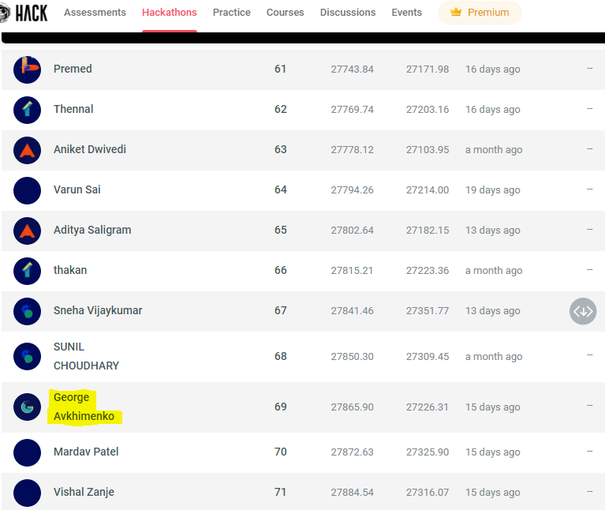

# Хакатон Hackathon Data Science Student Championship South Zone

Репозиторий посвящен участию в хакатоне [Hackathon Data Science Student Championship South Zone](https://machinehack.com/hackathons/data_science_student_championship_south_zone/overview), проходившему с 12 мая по 6 июня 2022г.

Хакатон посвящен прогнозированию арендной платы за квартиру в Индии. На момент окончания совевнования было занято 69-е место на private leaderboard.

  
